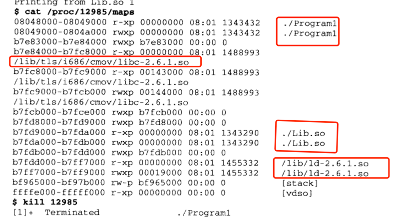

# 第二部分 第七章 动态链接

## 7.1 为什么要动态链接 ？?

疑问： 在运行程序P1时，如何知道P1依赖了模块a，如何知道a依赖了模块b？

疑问： 是在链接完成后才真正启动程序P1的吧？

P2依赖了模块a，当程序P2运行时，由于模块a已经在内存中，所以没有必要去重新加载模块a了。只要完成P2和模块a的链接即可。 ？？ 内存也可以链接吗？ 是指虚拟地址空间的的分配和映射？
进程的内存空间不是独立的吗？

共享库怎么实现共享的？ ？

- 内存和磁盘的空间 静态链接下，一个程序会在磁盘和内存中依赖一个共用库函数，假设为1M，那么如果存在多个程序，因为是静态的，所以会导致存在多份相同的库函数，白白浪费了几十M空间。这是无法接受的。！

静态库是典型的浪费空间的例子。

- 程序开发和发布 当依赖的一个sdk修复bug后，程序必须要重新静态链接sdk库，打包再发布。当有多个模块时候，那么就要多次下发整个程序。

- 动态链接 把每个模块独立出来作为单独的目标文件，但不在编译后链接，而是在运行时才去进行动态链接 dynamic linking。

当程序需要某个模块时，首先是在物理内存中查找是否存在，如果存在则直接在内存中链接。 优点： 1 减少磁盘和内存中占用 2 减少物理页的换入换出 3 提高CPU命中率，提高缓存
4，便于升级，程序下次启动时候就加载了新的代码AAAS

- 程序可扩展性和兼容性

动态链接库让程序可以在运行时候动态选在装载哪个模块，这可以用来制作插件 plugin-in。
比如编写完成程序，定义接口文件。比如加载某个功能。其他人只要实现了这个接口，那么程序就可以在运行时动态加载该模块，动态链接实现程序的扩展功能。

提高兼容性

- 动态链接的基本实现

基本思想是按照模块拆分为独立的部分，在程序运行时才将他们动态的链接起来，形成一个完整的程序。 也即是说没有这个模块，那么程序就不能运行咯？ 动态分享对象 dynamic shared
object。在linux下以.so结尾的文件。windows下为dll文件。

动态链接涉及运行时的链接以及多个文件的装载。必须要有操作系统的支持，因为动态链接情况下，进程的虚拟地址分布要比静态链接下更加复杂。还涉及了存储管理、 内存共享、进程线程的机制也会产生微妙的变化。

当程序被装载的时候，操作系统的 动态链接器 会把程序依赖的动态连接库也装载到进程的内存空间，并且将程序中所有为决议的符号绑定到相应的动态链接库中。

接着，还是由动态链接库来完成链接工作。而不是之前的静态链接器ld。 本质上吧链接过程从装载前 转移到了装载的时候。

虽然说装载时候去链接会耗时，但是用时间换扩展性还是很值得的。

## 7.2 简单的动态链接例子

p1.c、和p2.c 都依赖 lib.c/lib.h中的foo函数，将lib.c打包成为动态链接库lib.so。 开会说编译p1.c为p.o。通过动态链接命令：

```
gcc -o p1.o lib.so
```

开始链接。 区别与静态链接，此时链接器发现foo函数是动态链接库中的符号，因此只是标记为动态链接符号，不会直接链接，而是要等到运行装载的时候才去链接。

- 模块角度理解 不管是主程序还是.so都是程序的一个模块。

- 动态链接程序运行时地址空间分布
  

进程中除了p1、lib.so之外，还有链接器ld-2.6.so和libc.6.1.so。都通过mmap映射方式映射到虚拟内存空间。
其实在系统运行p1程序之前，会先执行链接器的链接工作，然后在交给p1.

共享动态链接库的装载地址在编译期是无法确定的，所以是ox000000000。只有在动态装载时候才能确定，此时系统会分配一块内存给so。

## 7.3 地址无关代码

### 7.3.1 固定装载地址的困扰

共享对象被装载时，如何确定它在进程虚拟地址空间中的位置？ 如果靠手工去确定A B C模块的地址，那么肯定会发生冲突！
描述的就是我们不能在编译时就确定动态分享对象.so的内存地址区间。因为如果一个动态分享对象被多个进程加载，那么就会存在与其他模块地址冲突的情况。

怎么办？ 让共享对象能够在内存中任意地址加载。

因此， 共享对象在编译时不能假设自己在虚拟内存空间的位置。 于此相反的是，可执行文件则可以知道自己在内存中的位置。

### 7.3.2 装载时重定位

疑问： 共享对象是存在独立的内存地址空间的，不属于如何进程？ 被所有进程共享？ 那进程如何访问共享对象里面的代码和数据呢？ 会不会拷贝一份到进程里面？ 如果拷贝岂不是又浪费内存空间了呢？

疑问： 共享对象是只被装载一次？然后被各进程在内存中动态链接？相当于虚拟映射一个文件，但是该文件在内存而已。 因此，进程中肯定要分配地址空间给动态分享库so？ 那岂不是固定了so的内存地址 ?
那岂不是每个进程中的固定地址都要分配给这个so？ 那其他so怎么定位分配呢？

静态链接对应： 链接时重定位。linking time relocation 动态链接对应： 装载时重定位。load time relocation
可执行文件可以在装载时进行重定位，确定各段的地址后，在去修改需要重定位的符号(指令中的符合或者数据中的符号)的地址。 但是，共享对象在装载时重定位有问题：
因为共享对象的指令是多个进程共享的，因此不能直接修改指令绝对地址，因为每个进程的地址是不一样的。而可修改的数据由于会拷贝一份到每个进程，所以可以在装载时候对绝对地址进行重定位。
也就是每个进程有一个副本，然后对副本进行重定位。

### 7.3.3 地址无关代码

装载时重定位本质上是修改 模块中的符号地址。 但是共享对象中的代码为了让进程共享所以不能被修改。因此，考虑将需要变化的指令部分放到数据侧，因为数据在每个进程有一个副本，
可以被修改。而不可修改的指令则可以被多个进程共享。 这种方案就是地址无关代码技术 PIC position-independent-code。

要确定地址无关代码，那么就要区分模块中地址引用类型：

1. 模块内的函数调用、跳转
2. 模块内的数据访问，如模块内定义的全局变量、静态变量
3. 模块间的函数调用、跳转
4. 模块间的数据访问，如其他模块定义的全局变量、静态变量

- 模块内的函数调用、跳转

当执行当前指令时如0x00000001，pc寄存器会保存下一条指令的地址0x00000002。当要跳转时，我们只要在pc地址上加上下一条指令的偏移(0x00000002+0x00000004)
就能跳转到想要的函数地址(0x00000006)里去，这对jump指令也是有效的。 现代的操作系统都支持相对偏移地址调用。 基于相对偏移、或者叫基于寄存器的偏移 的指令是不需要重定位的。

小端 little-endian ：如 E8 E8 FF FF FF ，那么地址为 0xFFFFFFE8 ，从右到左，小端开始。 大端 large-endian ，那么地址为：0xE8FFFFFF

- 模块内的数据访问 由于是同一个模块内，即使不在同一个段，那么只要加上段偏移即可访问到数据段的数据。 如何得到当前指令的pc寄存器中的地址呢？
  当执行到当前指令时候，那么pc就会自动存储下一条指令，也就是栈顶sp指向该条指令，此时通过系统调用__i686.get_pc_thunk.cx执行指令 mov (%esp) (%ecx)
  ，cx寄存器中就会存储了sp的地址。 然后在执行add和mov1两条指令，让cx寄存器中的值加上两个偏移量0x118c和0x28即得到变量a的地址。 这也是不用重定位的。

- 模块间的数据访问

基本思路： 通过在进程的数据段建一个全局偏移表GOT，本质上是一个指向了共享模块中的全局变量的指针数组。
当程序需要去访问到共享模块的全局变量时，会首先在GOT中找到对应的项，然后根据里面的地址直接访问变量。 GOT是在进程装载时动态链接器会自动搜索所有引用到的共享模块的变量地址，填充到GOT表中。
这种间接引用变量的地址，也实现了地址无关性。

具体过程： GOT在本进程中的相对偏移地址是在编译期就能确定的。因此：
访问变量b，那么就要找到当前指令执行时候的pc值，然后加上GOT在进程偏移地址offset，然后加上变量b在GOT中的偏移地址，找到在GOT中对应的项，从对应项中得到变量b最终的地址。

- 模块间的函数调用、跳转

类似于数据访问，也是通过GOT来访问函数的地址。 先得到当前指令pc值，加上偏移得到GOT，加上变量在GOT中的偏移得到表项，间接调用函数地址。

总结： 模块内：通过相对偏移地址来访问。 模块外：通过GOT来访问。

疑问： 什么是地址无关代码？？？ 就是指共享模块中的不可变代码PIC，说白了就是代码的地址不能被改变！。 主程序的代码肯定不是地址无关代码(当然通过编译器也可以指定为地址无关执行文件PIE)
，共享模块中可变代码也不是地址无关代码！！由于它是可以改变的，所以跟着数据段一起在进程中有一份副本。

### 7.3.4 共享模块的全局变量问题

一个共享模块中定义了全局变量，即使是在模块内部调用，这个全局变量会被当成是跨模块的情况来对待，通过GOT来访问到该变量在进程中的副本。 疑问：
两个进程，都使用了共享模块中的全局变量，那么一个进程修改该变量会对另外一个进程的变量产生影响吗？ 不会！进程在引用共享模块的数据时是会拷贝一份的。

疑问： 一个进程中的两个线程呢？ 会，因为线程间的全局变量是可见的。

疑问： 能不能让两个进程之间共享一个全局变量呢 ? 能！ 这样就可以实现进程通信了。 鞥不能让两个线程访问全局变量不同的副本呢？ 能！通过thead local storage来实现！！

### 7.3.5 数据段地址无关性

动态共享模块中的数据段，由于会被拷贝一份到进程中，所以可以在装载时重定位来修改绝对地址。因此，无需使用地址无关性。编译器在编译的时候，发现如果是绝对地址引用那么就会
添加到重定位表中。在装载时候进行重定位。 代码段则不同，要实现进程共享，那么地址就不能被修改。也就只能在编译试的时候产生地址无关代码，通过got端来实现间接访问。

## 7.4延迟绑定(PLT)

动态链接的总结： 假设进程用到了共享模块a 1 进程要访问模块a的代码时候，判断虚拟内存中有没有模块a存在，如果没有则暂停进程，先把控制权交给动态链接器，把模块a装载到虚拟内存(
注意装载的概念，本质上就是映射segment等)，同时如果模块a依赖了别的模块那么也一起装载映射，形成虚拟映像。 2
进程暂停中，动态链接器执行一次连接过程，对内存中的模块a进行链接，数据部分进行符号重定位工作，耗时 3 代码部分针对全局和静态数据进行got的定位、填充。同时也可以完成所以函数的got定位和填充。耗时
4 对于模块间的调用也需要先got的定位，在跳转。 耗时 5 完成链接后，把控制权交还给进程，此时进程才开始真正的执行。

那怎么办呢？ 采用延迟绑定！！！

- 延迟绑定的实现 lazy binding 在动态链接的过程中，为了加快进程的启动速度，我们避免在启动的时候就去绑定所有的函数got。而是等待第一次调用的时候才去对函数符号进行绑定(查找和重定位)
  ，没有用到则不绑定。

ELF使用了PLT(procedure linkage Table) 程序链接表？？来实现这个技术。

原理：

在动态链接之下，模块之间往往伴有大量的函数调用(全局变量较少，因为大量的全局变量导致耦合变大)。 当调用某个外部的函数时，如模块a.so调用模块b.so的方法foo()
，由于是延迟绑定，所以不是直接通过got去跳转，而是通过got.plt表项中去跳转， 每个外部函数的调用都会在plt中有对应的plt项，如foo@plt。这个项的结构为：

```
foo@plt:
jump *(foo@GOT) 
push n
push moduleID  //一般有链接器在装载时初始化
jump _dl_runtime_resolve // 一般有链接器在装载时初始化
```

第一条指令是通过got来跳转，如果链接器在装载的时候就初始化了got，那么此时的地址就是我们的目的地址，实现了foo函数的调用。但是为了
延迟绑定没有初始化，所以此时的地址是第二条指令的地址，因此，在到了push n。 第二条指令的是吧foo函数在重定位表(.rel.plt)中的的下标压入栈中，这个操作不会任何耗时
第三条指令则是膜发生调用的模块名字压入栈中，很明显是为了调用后面的函数，准备参数。 第四条指令，_dl_runtime_resolve经过一些利的工作，把foo函数的地址填充到foo@GOT中。

在glibc. so的动态链接器会根据发生调用的模块和调用的函数来进行查找，查找的函数为_dl_runtime_resolve(moduleName,funcName)。

一旦解析完成，后续调用foo则只会执行第一行指令，后续的指令都不会执行。

具体elf 划分为了两个表： .got 和 .got.plt GOT 表用来存储全局变量的地址 .got.plt表 则用来存储外部函数调用的地址

PLT 以独立的段存在于elf文件中，段名为 .plt 。由于它的地址无关性，所以跟着代码段一起合并为可读可执行的"segment"被载入内存。

疑问： 是每个模块都有一个plt和got吗？？ 还是只有可执行文件才有？？ 答： 可执行文件和共享对象都有。因为got属于data段，.got.plt属于代码段，因此，也会在进程中拷贝一份。

## 7.5 动态链接相关结构

静态链接下可执行文件加载过程：

加载可执行文件，访问文件头，检查合法性，然后访问里面的program header table表，以segment段来进行映射到虚拟内存 操作系统把CPU的控制权交给进程，开始执行。

但是，动态链接情况则不一样了

加载文件的文件头，检查合法性，然后访问程序头表，得到各个segment的虚拟地址，映射到内存中。 然后操作系统会启动一个动态链接器(dynamic linker)在加载动态链接器
ld.so模块，同样也映射到进程的虚拟内存中。 接着把控制权交给动态链接器的入口中，根据环境参数等开始对进程进行一系列的动态链接工作。
当所有的动态链接工作完成后，控制权才交回到程序的入口处，从而进程开始正式执行。

### 7.5.1 .interp 段

那么一个elf文件怎么知道是不是动态链接器呢？ 通过section段 .interp 来识别，interpreter 解释器的意思。

.interp 里面存储的就是动态连机器的地址，一个字符串。系统在加载可执行文件的时候，会根据.interp段的内容去加载程序所需要的动态链接器。

### 7.5.2 .dynamic 段

动态链接器所需要的信息都在.dynamic段里面，如：依赖哪些共享对象？ 重定位表的位置、符号表的位置等。 .dynamic 段可以看成是 静态链接下的 "文件头"。

### 7.5.3 动态符号表 dynamic symbol table

import 符号，表示引用了该符号 export 符号，表示定义了该符号。

动态链接符号表 .dynsym 段定义了该模块符号的导入和导出关系，只保存于动态链接相关的符号，如私有变量则不保存，而.symtab则保存了所有的符号。

### 7.5.4 动态链接的重定位表

只有导入import 的符号才需要重定位。 静态连接下，模块经过编译得到.o，在链接过程中就要完成符号的解析和重定位。 动态链接下，经过PIC地址无关代码
编译后，在运行期装载的过程中可变的代码部分和数据段也是需要重定位的。因为有绝对地址出现。 而这些重定位表为： .rel.dyn 和.rel.plt，对应.rel.data和.rel.text。
.rel.dyn是对数据段的修正 .got， .rel.plt是对代码段的修正 .got.plt。

疑问： 函数的重定位入口是不是都只在.rel.plt中呢？ 不是的。只有经过PIC编译的才是，相对地址来访问。非PIC编译 代码是以绝对地址来表示，需要重定位。

### 7.5.5 动态连接时进程堆栈初始化信息

## 7.6 动态链接的相关步骤和实现

基本分为三步： 1 启动动态链接器 2 加载所需共享对象 3 开始链接，完成符号的解析和重定位、初始化

### 7.6.1 动态链接器的自举

动态链接器的职责是加载和链接(重定位) 其他共享对象模块。 但是，动态链接器本身也是一个共享对象。所以，当系统把控制权交给动态链接器时，
他会执行一段特殊的代码完成自身全局和静态变量以及函数调用的重定位，这一段代码叫做自举 bootstrap。 自举完成后，才能访问全部变量和进行函数调用。

动态链接器的自举入口就是执行入口，首先找到GOT，GOT第一项就是.dynamic段，然后得到符号表、重定位表的位置，完成重定位后，就能访问全局和静态变量以及函数调用了。

### 7.6.2 装载共享对象

当链接器完成自举后，把自身的符号表和可执行文件的符号表合并为一个表，就是全局符号表 global symbol table。 然后根据可执行文件或者共享对象的.dynamic
段中的zt_needed字段，来加载所需要的其他共享对象。 把共享对象放入到加载集合中，吧共享对象的代码和数据映射到进程的地址空间中。合并到全局符号表中。如此，遍历。 完成图的遍历：
广度优先或者深度优先。

- 符号的优先级

当两个不同的共享对象定义了同名的符号，如同一个函数名字，执行不同的功能。那么链接器加入到全局符号表中的时候，会忽略调后面的符号。
也就是说一个共享对象的全局符号被另一个共享对象的全局符号覆盖的情况，叫做全局符号接入 global symbol interpose。

链接器默认使用第一个加载的全局符号，忽略后者。

- 全局符号介入与地址无关代码 全局接入可能会引发第一种的模块内部调用变成第三种方式，通过got.plt来实现。 不用在意这些细节。

### 7.6.3 重定位与初始化

在完成上述步骤后，链接器编译可执行文件和共享对象的可重定位表，完成GOT/PLT的每个表中需要重定位的符号的修正。
完成重定位后，如果共享对象有.init段，则会执行.init段，共享对象中c++的全局/静态对象的构造就在此执行，如果有.final段，在程序结束时也会执行.final段 代码，实现c++
全局对象的析构过程。

可执行文件如果有.init和.final段，则不会执行。会让程序自己来执行。

最终，完成了共享对象的重定位和初始化，链接器如释重负，把控制权交给进程入口。

### 7.6.4 linux 动态链接器的实现

动态链接器本身也可以作为入口执行。跟可执行文件没太大区别。

## 7.7 显式运行时链接

支持动态连接的系统往往支持另一种更加灵活的模块加载方式： 显示运行时加载 (explicit run-time linking)
，也叫运行时加载。

也就是说程序在运行时自己控制加载某个共享对象，还可以在不需要的时候卸载。 这种共享对象呗叫做动态加载库(dynamic loading library)，这和共享对象没啥区别，实用角度不同而已。

优点： 1 按需加载，减少了程序启动时间和内存占用 2 对于长期运行的程序来说，可以在运行时重新加载某个模块来实现模块的增加、更新、删除等。

在linux中 动态装载库和共享对象没区别。唯一不同就是 共享对象是动态链接器在程序启动前自动完成装载和链接的，对用户程序是透明的。 而 动态装载库 则是由用户程序通过动态链接器提供的API(
打开dlopen()，查找符号dlsym()，错误处理dlerror()，关闭动态库dlclose() )，来对动态库执行操作。

### 7.7.1 dlopen()

函数原型：

```
void *  dlopen(char * filename,int flag);

```

功能为：打开一个动态库文件，将其加载到进程的地址空间，完成初始化。 参数一 filename 动态库的路径。

如果将filename参数设置为0，那么dlopen返回的是全局符号表的句柄。这就意味着我们可以在运行时访问全局符号表中的任意符号，并且可以调用他们。实现类似高级语言的反射的效果。

全局符号表包含了进程和被链接器加载的共享对象的所有符号，以及在运行时通过dlopen打开且设置了RTLD_GLOBAL标志的动态库中的符号。

参数二 flag 表示符号的解析方式。 RTLD_LAZY 表示延迟加载，即在函数第一次调用的时候才去加载，PLT模式。 RTLD_NOW,
表示立刻加载，即在装载的时候就完成所以函数符号的绑定工作，如果有未决议的符号，dlopen就会返回错误。

这两种方式必须要选择一种，另外还有一个常量RTLD_GLOBAL，可以一起使用|。 表示是否将被加载模块的全局符号表中的符号合并到进程的全局符号表中，让后续的模块可以使用。

因此，在调试的时候可以采用RTLD_NOW，今早暴露问题，当然加载库的速度也会慢。

注意： dlopen返回的是加载模块的句柄，如果加载失败则返回null。这个句柄后续再dlsym和dlclose中需要用到。
如果被加载模块存在依赖关系，那么也需要程序手动先加载依赖的模块在加载被加载模块。 dlopen加载的过程还会调用模块的.init和.final 段的代码。

### 7.7.2 dlsym()

函数原型：

```
void * dlsym(char *handle, char * symbol)
```

dlsym 是运行时装载的核心部分，我们可以通过该函数找到所需要的符号。

参数一： 由dlopen返回的动态库的句柄， 参数二： 要查找的符号名字

如果找到了则返回该符号的值，没有找到则返回null。 符号的值分情况： 1 如果是找函数，则返回函数的地址 2 如果找到是变量，则返回变量的地址 3 如果找的是常量，则返回常量本身的值。

第三种情况下，如果该常量的值本身就是null，那如何判断是否成功找到了呢？ 通过dlerror来判断，如果返回null则是成功，如果返回错误信息就失败。

- 关于符号： 符号不仅仅是函数和变量，也还有常量。 如文件名。

- 符号的优先级 前面说过，在动态链接时，如果两个共享模块出现了重名冲突，那么就先装载的优先，后续的忽略。也称为装载序列 oad ordering。
  那么当使用dlopen装载动态库时候，出现重名怎么办？ 当然还是采用装载序列的方式进行链接。

疑问： 当dlsym查找符号时候，采用的是哪种序列方式？ 1 如果传入的句柄是全局符号表，那么找到符号也就符合装载序列 2 如果传入的句柄是某个打开的共享对象，那么采用的是依赖序列(
dependency order)，也就是从该共享对象开始到所依赖的对象中进行广度优先查找，找到就停止。

### 7.7.3 dlerror()

每当调用dlopen、dlsysm、dlclose后，都会收到dlerror的回调。返回的是char * 。如果返回null则表示成功，否则返回错误信息。

### 7.7.4 dlclose()

将一个加载成功的模块，完成卸载。操作系统维持了一个引用计数器，每dlopen了一个模块就加一，每dlclose了一个模块，则减一，知道为0表示所以模块都已卸载。

卸载的过程： 先执行.final段的代码，删除符号表中的符号信息。然后取消与进程的内存映射关系，关闭模块文件。

### 7.7.5 运行时装载的演示程序

略

## 7.8 小结

总结： 


