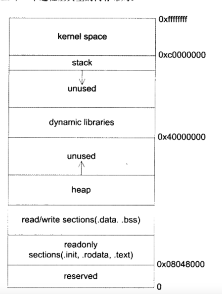

# 第四部分 库与运行库

# 第10章 内存

## 10.1 程序的内存布局

内存布局如图：


从上往下，高地址-->低地址：

1 内核区： 操作系统内核程序占用 2 栈区 ： 预留几十M空间大小，向下增长，直到耗尽。oom 3 动态库： 用来映射动态库共享对象 4 堆区： 一般预留几百M或者上G的大小，
程序自己维护的区域。通过malloc和new来申请，向上增长。直到耗尽。oom 5 可读可写数据区： .data .bass sections。 6，只读可执行代码区： .text .init
.rodata 7 reserved受保护区 程序不能访问 比如指针指向的0地址不能被访问。

5 6 统称为可执行文件影像，由装载器把可执行文件的内存读取映射到这里。

## 10.2 栈与调用惯例

### 10.2.1 什么是栈？？

所以程序都使用了栈，没有栈就没有函数，就没有局部变量，也就没有计算机语言。

在计算机系统中，栈是一块动态的内存区域，特点是先入后出。你可以把一个变量压入栈中，也可以把变量弹出栈。栈的访问是通过ss：sp来完成。 esp寄存器始终指向栈顶的位置。
在栈上压入数据会让sp减小，弹出数据会让sp增大。同理，修改sp的值让其减小其实就是增大栈的空间，让其增大则是回收栈空间。

栈保存了一个函数调用需要保存的信息，也就是栈帧(Stack Frame)或者 活动记录(Active Record)。一般包含如下:

- 函数的返回地址和参数
- 临时变量 函数内部的非静态变量和编译器临时产生的变量
- 保存上下文 保存了在函数调用前后需要保持不变的寄存器。

一个函数表示一个栈帧，那么栈帧的区域是如何定位范围的呢？ 通过ebp和esp两个寄存器来决定。 ebp又称为帧指针(stack pointer)，它指向了栈帧中一个固定的位置，esp则始终指向栈顶。

一个函数的栈帧的结构从上到下依次为：

```
参数
返回地址
old bp <-------ebp
保存的寄存器
局部变量
其他数据
       <--------esp
```

函数调用过程：

1. 把所有参数或者部分参数压入栈中，如果其他参数没有被压入栈中，则通过特殊的寄存器来传递
2. 把当前指令的下一条指令地址当做函数的返回地址压入栈中。
3. 跳转到函数体，开始执行

其中第2 3 条指令通过call 指令一起执行。

函数开始执行后，发生了什么呢？

```
push ebp   把ebp压入栈中，保存旧的ebp
move ebp esp  让ebp指向esp 栈顶，新的ebp位置确定了
sub esp xxx  减少esp，增加栈空间
push xxx  包不变的寄存器压入栈中保存
```

函数执行完毕后，又发生了什么？

```
pop xxx 如果必要，恢复某些寄存器
move ebp esp  让esp指向ebp的位置，回收占空间 
pop ebp 从战中恢复ebp的值
ret   跳转到返回地址 
```

### 10.2.2 调用惯例 calling convention

- 函数参数的传入顺序和方式

### 10.2.3 函数返回值的传递

c++返回对象，会拷贝两次？？

## 10.3 堆与内存管理

### 10.3.1 什么是堆？？

堆是一块巨大的内存空间，常常占据整个虚拟内存的绝大部分。

为什么要有堆？

因为栈上的数据(内存空间)会随着函数结束被释放, 无法将数据传递到函数外部。 同时，全局静态变量无法动态产生，只能在编译的时候定义，缺乏表现力。

内存的申请例子：

```
char *p=(char *)malloc(1024);
free(p);

```

malloc()函数是怎么申请内存的呢？ 第一种方式，直接吧内存申请的操作交给内核，但是这样每次申请都要经过内核调用，比较耗时。
第二种方式，是程序直接向内核申请一块合适大小的区域，然后自己来管理。分配给程序自己使用。通过运行库向系统申请内存区域，然后零售给程序使用。

那么，运行库是如何向操作系统申请内存的呢？？

### 10.3.2 linux进程堆管理

通过两种系统调用的方式申请：

第一种方式， 通过brk()系统调用，brk()内部其实调整数据段的结束地址，从而间接来控制堆的大小。 第二种方式，通过glibc.os的 mmap()
系统调用来申请一段虚拟内存地址空间，这块虚拟内存空间可以映射到某个文件(这是它最初的作用)
，当没有映射到文件时候，就称为匿名内存区域，这块匿名内存区域就可以拿来当做堆内存。 mmap函数原型：

```
void *mmap(
void *start,  开始位置，如果设置为0则有系统分配。
size_t length, 内存的长度
int prot, 可读、读写、可执行权限、映射类型：文件映射，匿名映射
int flags,  可读、读写、可执行权限、映射类型：文件映射，匿名映射
int fd, 映射文件的文件描述符
off_t offset) 映射文件的偏移
```

因为mmap都是系统虚拟空间申请函数，他们申请空间的起始地址和大小都必须是系统页的整数倍。对于字节数很小的申请，如果采用mmap则太浪费。

因此，malloc() 函数的到内部逻辑是怎么样的呢？ 申请的空间小于128kb，则在栈上开辟空间。反之，超过则在堆上通过mmap来开辟匿名用户空间。

### 10.3.3 windows 进程管理

略

### 10.3.4 堆分配算法

为什么要有堆的分配算法？？ 应用程序通过malloc()中的mmap()
函数来申请空间。得到空间的起始地址是动态变化的，因此，如果管理这一大块的连续的内存空间，如何回收起来重新出售给程序使用，按照需求分配、释放空间？？

- 1 空间链表

双向的空闲链表，把空闲的区域用链表串起来，如果被使用则从链表移除。恢复则加回来。 缺点： 容易断链，不够稳定

- 位图 bitmap

把整个区域按照固定大小的块block来进行划分，程序每次申请内存都是块的整数倍。 申请的内存组织形式为： 第一个块是Header，后续已占用的都是Body。 未被占用的内存都是free。

因此，一个block只有三种状态： H/B/F ，用两位的二进制即可表示一个块，因此也叫位图 bitmap。

我们可以用一个整数数组来记录块的使用情况？ 怎么记录？ 注意，这里说的是使用情况，而不是说记录大小。只需要关心块的数量，以及每个块的状态即可。

```
例子： 1M的空间，块的大小为128KB。那么需要int数组的长度是？
两个bit表示一个内存块的状态，一个int(32)就能表示 16个内存块的状态。
同时，内存块的总个数为： 1M/128KB=8K。
所以， 需要int的个数为： 8K/16= 512。
所以，int数组大小为512。 
```

当申请到空间后，位图相应的位置就会被标记状态：头或躯体 。

优点： 不需要额外的空间 访问数组，容易命中cache。为啥？ 因为数组是连续内存分布，容易被CPU的缓存命中。

缺点： 如果块大小 太大则会产生碎片。 如果块太小，则会增加位图的长度，降低cache命中率

- 对象池

通常分配对象的大小一般为固定的，因此，如果每次申请的大小都一样，那么就按照这个大小对堆进行划分。

对象池内部管理可以使用链表、也可以使用位图来实现。

## 10.4 本章小结 


