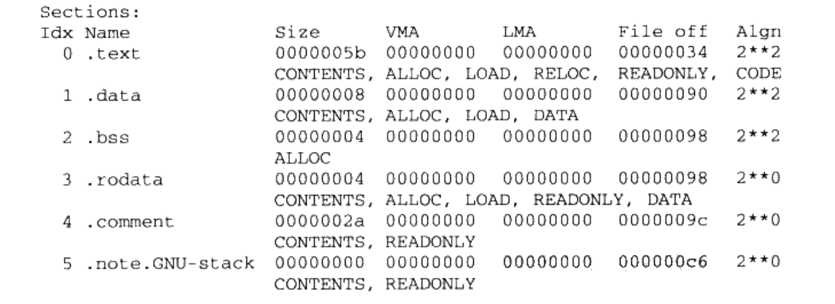
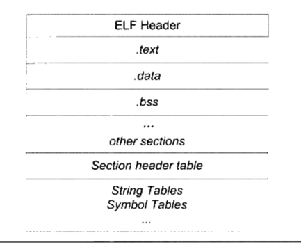
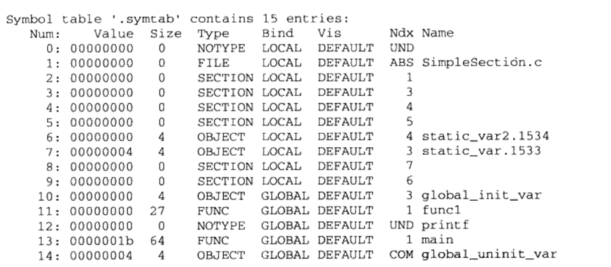

# 第二部分的第三章 目标文件里有什么？

目标文件本身就是按照可执行文件的格式来存储的。只是某些符号：变量或者函数没有调整地址。因此，了解目标文件的结构很有必要。

## 一、目标文件的格式

目标文件和可执行文件都是同一种格式。windows下为PE(portable executable),linux下为 ELF(executable linkable format)。
他们都是COFF(common file format)的变种。

不光是可链接目标文件(windows下的.obj，linux下的.o),还是可执行文件(windows下的.exe，linux下的.elf可执行文件)按照可执行文件的格式存储。 连 动态链接库(
dynamic linking library)(windows下的.dll，linux下的.so)，还是静态链接库(static linking library)
(windows下的.lib,linux下的.a)也是按照可执行文件格式存储的。

也就是在Windows下都是按照PE-COFF格式存储，在linux下都是按照ELF格式存储。

linux的ELF格式划分四类：

- 可重定位文件格式 relocatable file 用途： 包含代码和数据。可以用来链接成为可执行文件或者共享目标文件。静态共享库也可以认为是可重定位文件。 例子： .o, .a , .obj ,
  .lib

- 可执行文件 executable file 用途：包含可执行程序。 例子：linux一般没有扩展名。 windows 为.exe

- 共享目标文件 shared object file 用途： 包含了代码和数据。
  既可以用来与其他可重定位的目标文件/共享目标文件，一起链接为新的目标文件；还可以将这些共享目标文件和可执行文件结合，作为进程映像的一部分来运行。 例子：.so .dll

- 核心转储文件格式 core dump file 说明：当进程意外终止时，系统可将进程终止时的地址内容和一些其他的信息，存储到核心文件中。

可通过file 命令来查看elf文件格式。

```
file xxx.so 

x86/libagora-rtc-sdk-jni.so: ELF 32-bit LSB shared object, Intel 80386, version 1 (SYSV), dynamically linked, BuildID[sha1]=93cb7cb9b41836c7d399081ed68872d808ee1b1c, stripped
```

### 1.1 目标文件是什么样的？

1. 存放编译后的机器代码，称为代码段 code segment或 code section。 .code/ .text
2. 已经初始化了全局变量或者局部静态变量存放到数据段 .data。 未初始化的全局变量或者局部静态变量存放到.bss段。
3. 文件头 File Header 表明该文件是否可以可执行，静态连接还是动态链接以及入口地址(如果是可执行文件)。 还包含段表section table，就是一个保存了各个段信息的数组。
4. .rodata 只读段，只读数据。如const修饰的常量和字符串常量。
5. .bss段

总结： 源代码经过编译后，会分成两种段：程序指令和程序的数据。代码段属于指令，而数据段和.bss端属于数据。 程序分开指令和数据的好处： 1，指令只读，数据读写。容易控制权限。
2，有利于提高CPU的缓存命中率，提高局部性。也就是说在某个时间段我只访问数据，或者只访问代码。 3，当系统运行多个程序的副本时候，它的指令是可以共享的。数据是私有的。因此，共享节省了很大内存消耗。

## 二、挖掘具体信息

通过工具objdump 和 readelf 命令来查看 可执行文件的格式。

### 2.1 查看主要段的信息 objdump -h xxx.so



```
[avengong@AvengongdeMacBook-Pro libs (develop=)]$ objdump -h armeabi-v7a/libagora-rtc-sdk-jni.so 

armeabi-v7a/libagora-rtc-sdk-jni.so:     file format elf32-littlearm

Sections:
Idx Name          Size      VMA       LMA       File off  Algn
  0 .note.android.ident 00000098  00000134  00000134  00000134  2**2
                  CONTENTS, ALLOC, LOAD, READONLY, DATA
  1 .note.gnu.build-id 00000024  000001cc  000001cc  000001cc  2**2
                  CONTENTS, ALLOC, LOAD, READONLY, DATA
  2 .dynsym       0000ca10  000001f0  000001f0  000001f0  2**2
                  CONTENTS, ALLOC, LOAD, READONLY, DATA
  3 .dynstr       0001f348  0000cc00  0000cc00  0000cc00  2**0
                  CONTENTS, ALLOC, LOAD, READONLY, DATA
  4 .hash         000052a0  0002bf48  0002bf48  0002bf48  2**2
                  CONTENTS, ALLOC, LOAD, READONLY, DATA
  5 .gnu.version  00001942  000311e8  000311e8  000311e8  2**1
                  CONTENTS, ALLOC, LOAD, READONLY, DATA
  6 .gnu.version_d 0000001c  00032b2c  00032b2c  00032b2c  2**2
                  CONTENTS, ALLOC, LOAD, READONLY, DATA
  7 .gnu.version_r 00000060  00032b48  00032b48  00032b48  2**2
                  CONTENTS, ALLOC, LOAD, READONLY, DATA
  8 .rel.dyn      00034628  00032ba8  00032ba8  00032ba8  2**2
                  CONTENTS, ALLOC, LOAD, READONLY, DATA
  9 .rel.plt      00000938  000671d0  000671d0  000671d0  2**2
                  CONTENTS, ALLOC, LOAD, READONLY, DATA
 10 .plt          00000de8  00067b08  00067b08  00067b08  2**2
                  CONTENTS, ALLOC, LOAD, READONLY, CODE
 11 .text         003b846c  000688f0  000688f0  000688f0  2**4
                  CONTENTS, ALLOC, LOAD, READONLY, CODE
 12 .ARM.exidx    00033f20  00420d5c  00420d5c  00420d5c  2**2
                  CONTENTS, ALLOC, LOAD, READONLY, DATA
 13 .ARM.extab    0003d23c  00454c7c  00454c7c  00454c7c  2**2
                  CONTENTS, ALLOC, LOAD, READONLY, DATA
 14 .rodata       0008c58c  00491ec0  00491ec0  00491ec0  2**4
                  CONTENTS, ALLOC, LOAD, READONLY, DATA
 15 .data.rel.ro.local 000008dc  0051f6a0  0051f6a0  0051e6a0  2**2
                  CONTENTS, ALLOC, LOAD, DATA
 16 .fini_array   00000008  0051ff7c  0051ff7c  0051ef7c  2**2
                  CONTENTS, ALLOC, LOAD, DATA
 17 .data.rel.ro  0002a1b0  0051ff90  0051ff90  0051ef90  2**4
                  CONTENTS, ALLOC, LOAD, DATA
 18 .init_array   00000134  0054a140  0054a140  00549140  2**2
                  CONTENTS, ALLOC, LOAD, DATA
 19 .dynamic      00000140  0054a274  0054a274  00549274  2**2
                  CONTENTS, ALLOC, LOAD, DATA
 20 .got          00001c4c  0054a3b4  0054a3b4  005493b4  2**2
                  CONTENTS, ALLOC, LOAD, DATA
 21 .data         00018590  0054c000  0054c000  0054b000  2**3
                  CONTENTS, ALLOC, LOAD, DATA
 22 .bss          00023da0  00564590  00564590  00563590  2**4
                  ALLOC
 23 .comment      0000013e  00000000  00000000  00563590  2**0
                  CONTENTS, READONLY
 24 .note.gnu.gold-version 0000001c  00000000  00000000  005636d0  2**2
                  CONTENTS, READONLY, OCTETS
 25 .ARM.attributes 00000038  00000000  00000000  005636ec  2**0
                  CONTENTS, READONLY

```

每个段包含信息为： name、size段大小、file offset 端的开始地址等。观察图片可知，每一个节的开始地址+节的大小，刚好是下一个节的开始地址。
0x00000034+0x0000005b(单位为字节)=0x00000090。

### 2.2 查看段的内容和反汇编

objdump -s -d xxx.o -s会把所有内容以16进制的形式打印出来， -d 会把代码段的内容反汇编,也就是得到汇编代码了！！

CPU的字节序byte order 问题： 大端big-endian 和 小端 litter-endian

### 2.3 其他段

.plt 动态链接跳转表 .got 全局入口表 详见第二部分内容。

## 三、ELF文件结构的描述


总结：elf文件包含文件头、各个段、段表、字符串表、符号表等

### 3.1 文件头 file header

通过命令 'readelf -h xxx.o '来查看文件头的信息： 包含魔数、文件类型、目标机器、段表的位置和长度、入口地址等信息。当我不知道这个so是哪个平台的时候，可以这样查看。

```
[avengong@AvengongdeMacBook-Pro libs (develop=)]$ readelf -h arm64-v8a/libagora-soundtouch.so 
ELF Header:
  Magic:   7f 45 4c 46 02 01 01 00 00 00 00 00 00 00 00 00 
  Class:                             ELF64
  Data:                              2's complement, little endian
  Version:                           1 (current)
  OS/ABI:                            UNIX - System V
  ABI Version:                       0
  Type:                              DYN (Shared object file)
  Machine:                           AArch64
  Version:                           0x1
  Entry point address:               0xd6c0
  Start of program headers:          64 (bytes into file)
  Start of section headers:          229968 (bytes into file)
  Flags:                             0x0
  Size of this header:               64 (bytes)
  Size of program headers:           56 (bytes)
  Number of program headers:         8
  Size of section headers:           64 (bytes)
  Number of section headers:         24
  Section header string table index: 23
[avengong@AvengongdeMacBook-Pro libs (develop=)]$ readelf -h armeabi-v7a/libagora-rtc-sdk-jni.so 
ELF Header:
  Magic:   7f 45 4c 46 01 01 01 00 00 00 00 00 00 00 00 00 
  Class:                             ELF32 // 文件位数
  Data:                              2's complement, little endian
  Version:                           1 (current)
  OS/ABI:                            UNIX - System V
  ABI Version:                       0
  Type:                              DYN (Shared object file)
  Machine:                           ARM //目标机器 
  Version:                           0x1
  Entry point address:               0x0
  Start of program headers:          52 (bytes into file)
  Start of section headers:          5650512 (bytes into file)
  Flags:                             0x5000200, Version5 EABI, soft-float ABI
  Size of this header:               52 (bytes)
  Size of program headers:           32 (bytes)
  Number of program headers:         8
  Size of section headers:           40 (bytes)
  Number of section headers:         28
  Section header string table index: 27

[avengong@AvengongdeMacBook-Pro libs (develop=)]$ readelf -h x86/libagora-rtc-sdk-jni.so        
ELF Header:
  Magic:   7f 45 4c 46 01 01 01 00 00 00 00 00 00 00 00 00 
  Class:                             ELF32
  Data:                              2's complement, little endian
  Version:                           1 (current)
  OS/ABI:                            UNIX - System V
  ABI Version:                       0
  Type:                              DYN (Shared object file)
  Machine:                           Intel 80386
  Version:                           0x1
  Entry point address:               0x0
  Start of program headers:          52 (bytes into file)
  Start of section headers:          13300200 (bytes into file)
  Flags:                             0x0
  Size of this header:               52 (bytes)
  Size of program headers:           32 (bytes)
  Number of program headers:         8
  Size of section headers:           40 (bytes)
  Number of section headers:         29
  Section header string table index: 28

```

### 3.2 段表 section header table

除了文件头，段表是最重要的部分。 段表描述了文件中各个段的信息： 名字、大小、在文件中的偏移位置等等。编译器、链接器、装载器都是根据段表来访问各个段的。

查看段表的信息：readelf -s xxx.so

段的类型、标志位、连接信息等等

### 3.3 重定位表 relocation table

也是elf文件中的一个段结构。

代码段或者数据段中的某些函数和变量，需要重新确定绝对地址时，就会记录在重定位表中。 .rel.data 数据重定位表 .rel.text 代码重定位表

## 3.4 字符串表

字符串因为是不固定的，所以不会直接存储字符串。而是存储字符串表：a、e、s、l等，只要记住开始和结束位置即可。 根据不同需求分为普通的字符串表和段表字符串表。 普通的字符串表： .strtab，
用来存储普通的字符串 段表字符串表： .shstrtab 用来记录段表的信息

总结： 解析elf文件头，得到段表和段表字符串表的信息，从而解析整个elf文件。

## 四、链接的接口--符号

我们关心两类符号： 在本文件中定义的全部符号，可以被其他目标文件引用；在本文件中使用，但是没有定义的全局符号。 不关心的内部符号：局部符号、行号、段名等。

- 查看符号表 命令： nm xxx.so

### 4.1 符号表的结构

是目标文件中的一个段。 .symtab。 包含：

1. 符号名：
2. 符号值：一般表示函数或者变量的地址。 目标文件中：表示所在段的偏移位置。或者对齐属性 可执行文件中：表示符号的虚拟地址，在动态链接中非常有用。
3. 符号大小：
4. 符号所在的段 ：如果是本目标文件定义，则表示段。如果没有定义则表示undefine。

- 查看符号表信息 readelf -s xxx.so 输出更加清晰。
  

就是一个数组。第一列就是数组的下标。 Ndx 表示在哪个段。在别的文件中定义的 就是UND

### 4.2 特殊符号

链接器ld 定义的。我们可以使用。如： 程序最开始的位置： _executable_start 程序结束位置: end / _end 代码段结束位置: _etext /etext 数据段结束位置: _
edata / edata

这些地址都为程序被装载时的虚拟地址。

### 4.3 符号修饰和函数签名

为了让库中符号名和程序开发冲突，编译器会在前面加入下划线。 _foo。但是有的编译器又不加下划线。因此，不同编译器编译的目标文件无法正常链接。
但是，还是无法完全避免命名冲突问题。因此，c++加入了命名空间，不同命名空间中的符号名可以相同。

- c++的符号修饰 c++ 有类、继承、虚机制、命名空间等特性，所以函数签名更加复杂。编译器需要自动加上这些信息避免重复。

不同命名空间，可以有相同的类名，不同的类中可以有相同的函数。。函数还支持重载，参数列表和返回值。 变量也是一样，会经过符号修饰。

### 4.4 extern "C"

为了兼容c的符号。 通过extern "C"来修饰，表示大括号内部的函数和变量，有c的规范来编译。c++编译器会把这些符号当做c语言来处理。

```
extern "C" {
    int func(int a);
    int var;
}
```

当然，也可以单独声明某个函数或者变量

extern "C" int func(); extern "C" int a;

其实本质上的区别就是，编译器对这些被修饰过的符号的，命名加不加下划线而已！

- 宏定义技巧

```
#ifdef __cplusplus
extern "C" {
#endif //表示如果是c++，则定义extern "C" {，声明是c编译规则。如果是c，那么就不用。
void *memset(void *,int,size_t);
#ifdef __cplusplus
}
#endif

```

### 4.5 强符号和弱符号

当链接器找不到该符号的时候或者多次定义的时候，就报错。这就是强符号。 弱符号，则可以被多次定义。如果没有改符号链接器也不会报错。 只是运行的时候报错。 类似于compileONly？？

- 强引用和弱引用 在最终链接成可执行文件的时候，如果一个符号没有正确决议，那么就会报错。这就是强引用。 相反，如果一个符号有定义，则决议。否则也不会报错。

两种引用的链接过程是一样的，区别就是报错与否。

疑问？？ 类名也是符号吧？？？

# 五、 调试信息

目标文件里面还有可能保存了调试信息。即调试表。

不管哪个编译器都支持源码级别的调试。 背后的原理就是 编译器要提前把源码和目标代码的信息对应起来。比如，目标代码的地址对应源码中的哪一行。当pc指向该地址时候，断点就走到源码中的某一行。
linux下可以通过strip命令 去除调试信息。 release包就是去掉了，所以没法debug调试。

## 4.7 小结 


