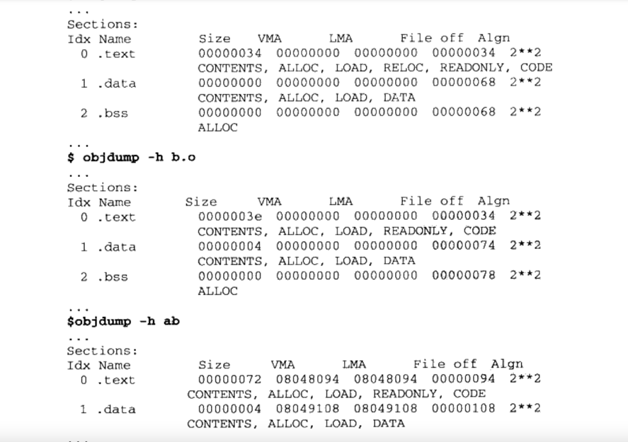
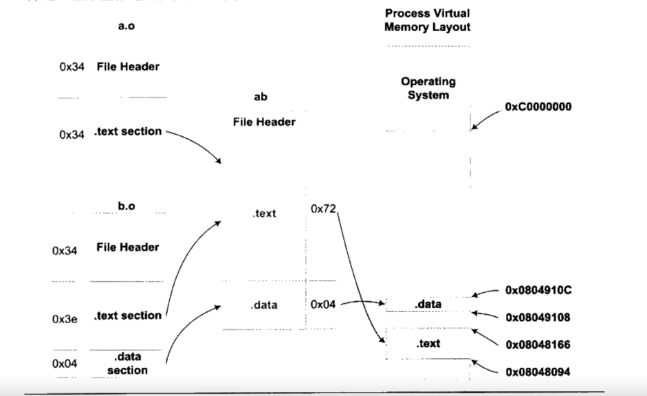

# 第四章 静态链接

经过前面的学习，我们终于elf目标文件格式的基本内容。给出让两个目标文件a.o和b.o，那么如何将他么链接起来合并成一个可执行文件ab？这个过程发生了什么？ 这就是链接的核心内容： 静态链接。

## 4.1 空间和地址分配

输入的是a和b两个目标文件， 输出的是ab可执行文件。 那么a和b中的段是如何合并成可执行文件中的段的？

通过相似段合并的方式，比如a的.text和b的.text进行合并，然后在可执行文件中分配空间来加载新的.text段。同理，data段也是如此。
另外，除了在可执行文件中进行空间分配以外，还需要对在装载后的虚拟地址空间进行地址空间分配，这决定了程序最终寻址地址。 而.bss段因为在可执行文件中是不占空间，所以只需要关心装载后的虚拟地址空间分配。

实际上，我们都只关心虚拟地址空间分配，因为这关系到了链接器后面对于虚拟地址的计算。 可执行文件中的空间分配与链接的过程其实关系不大！！

因此，我们这里讲的空间实际上指的是装载后的虚拟地址空间。

### 4.1.1 相似段合并

所以，整个链接的过程分为两步链接： two-pass linking：

1. 空间与地址分配 链接器会收集所有输入目标文件的各个段信息：长度、位置等，同时把各个目标文件的符号表中全部符号定义和符号引用(是静态符号还是动态符号)
   ，汇集到一个统一的全局的符号表中，再跟输出可执行文件的各个段进行映射，联系起来。
2. 符号解析与重定位 根据上一步得到的各个段的数据、重定位表信息，进行符号解析和重定位，调整代码中的地址等。 这是链接的核心。

也就是说，在链接之后，可执行文件其实已经确定了VMA的地址和长度 ？

通过objdump -h xxx.o来查看链接前后的虚拟地址的变化：

VMA：virtual memory address, 虚拟内存地址 --关心这个即可 LMA: load memory address 加载内存地址 二者一般情况下是一样的。我们只关心VMA 和
size。 file offset就不用关心了。

最终映射到进程映像的效果如下：

链接前，输入文件中的地址都是0，因为没法确定。链接后，等空间分配完毕，才能确定下来地址。 注意，elf文件的起始地址就是0x08048000。

### 4.1.2 符号地址的确定

经过段的合并，段地址其实已经确定了下来。由于符号在各自段内的相对位置是确定的，因此，只要在相对位置加上段的起始位置，即可确定符号在进程中的虚拟地址。

## 4.2 符号解析与重定位

### 4.2.1 重定位 核心

在输入目标文件中，需要重定位的符号是不知道它的地址的，因此，只能用0 来占位。当链接器完成空间和地址分配后，就知道所有符号的虚拟地址空间了。链接器就对每个需要重定位的指令，进行修正。也就是重新定位。

- 查看反汇编结果，得到汇编代码 objdump -d xxx.o

### 4.2.2 重定位表

那么如何确定哪条指令需要被重定位呢？？ 通过.rel.data 或者 .rel.text这些重定位表来知道哪些符号需要被重定位。

通过objdump -r xxx.o来查看某个文件的可重定位表。

### 4.2.3 符号解析

符合重定位的过程，也就包含了符号的解析过程。根据重定位表，会在所有输入目标文件中查找， 能够正确的找到某个符号，才不会报错。否则则会报错。

### 4.2.4 指令修正方式

绝对寻址：表示绝对的虚拟地址。 相对寻址：地址的偏移量。

## 4.3 COMMON 块

现在编译器和链接器支持弱符号处理，也就是COMMON block机制。 当目标文件中有未初始化全局变量时，就当做是弱符号来处理，用SHN_COMMON来修饰。
因为编译器此时无法知道该变量的类型和大小，因此不能放到.bss段。而当链接器链接过程时，已经知道了每个符号的类型和大小，此时就可以把弱符号放在新文件中的.bss段。

申请临时空间用来存放弱符号。

## 4.4 c++ 相关问题

疑问：？？ 目标文件a，引用了目标文件b中的全局变量。那么当a和b通过链接合并成一个新的目标文件的时候，那个全局变量会不会变成局部变量？ 不会！ 链接只是把文件链接起来而已，并不会改变目标文件的结构。

## 4.5 静态库链接

xx.a 静态库可以认为是一堆目标文件的集合。 当链接过程中，链接器并不是把静态库中所有的目标文件xx.o文件，全部链接进来，而是只链接符号引用到的文件。
没有被引用到的文件就不需要链接到目标输出文件中。

