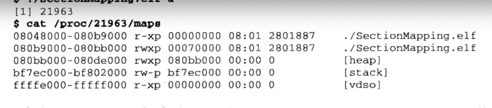

# 第三部分 装载和动态链接

# 第6章 可执行文件的装载与进程

## 6.1 进程虚拟地址空间

- 程序和进程的概念 程序是静态的，包含了一些编译好的指令代码和数据集合的文件。进程则是动态，指程序运行的一个过程，动态库又叫做运行时Runtime也有这个道理。

程序 -菜谱 数据-菜、调料 CPU-初始 硬件-厨具 进程- 炒菜过程。 内存-碟子

mmu 是啥？ 进程只能寻址0~4G虚拟空间？ 那超过了怎么办？

- PAE physical address extension 物理内存扩展。

地址总线位数改为36位。 一个应用能否访问超过4G的内存空间，如果是说虚拟地址空间那不能，因为32位CPU的指针最大寻址控件就是4G
。但如果是指计算机内存空间，那么是可以的。但是这由操作系统来完成，app 感受不到。 具体的使用过程：
系统在虚拟地址空间开辟一段固定大小的空间如256M（窗口），然后在物理内存上划分多个同样大小的内存块A B C。让虚拟内存空间窗口通过 mmap()系统调用 (wiindows 为AME)
映射到其中一块上A，当用到B时就切换到B，如此，便可以使用窗口访问多个内存块。

当燃这只是一个过渡的阶段，做好是升级到64位系统和CPU。

## 6.2 装载的方式

动态加载方式。 如果把整个可执行的文件加载内存，基本上不能实现。 因此，利用局部性原理让常用的常驻在内存，不常用的则放到磁盘。需要使用的时候动态加载。

- 覆盖装载 已过时。
- 页映射

它在虚拟存储机制下的产生的。 把物理内存(虚拟内存呢？？) 和所有磁盘上的代码和数据按照页的大小进行分页。每次操作都是以页为单位。 page的大小硬件规定为 4k、8k、2M、4M。

## 6.3 从操作系统角度看可执行文件的装载

如果程序使用物理内存地址直接操作，那么每次程序从磁盘中装载进来的时候就要重定位地址。 而在虚拟存储中，现代硬件MMU提供了地址转换的功能。 页映射+地址转换功能让操作系统很是方便的动态加载elf文件。

## 6.3.1 进程的建立

包含三个过程：

1. 创建一个独立的虚拟地址空间 本质上是创建一组映射函数，让虚拟地址空间对应物理内存空间。linux系统上，实际上只需要指定一个映射的目录即可，真正的映射关系等到发生缺页错误的时候在指定。   
   这种映射其实就是一个数组mmap[] ，一个元素就是一个内存虚拟页描述(包含该页所在的VMA段)，0表示未占用，1表示占用。 疑问：：确定 ？？？

2. 读取可执行文件的文件头，建立可执行文件与虚拟地址空间的映射关系

前情提要： 文件头里面包含：section table、魔数、执行入口地址(可执行文件)、目标机器等信息。

上一步建立好了虚拟页和物理页的映射关系。这一步则要建立虚拟页与可执行文件的映射关系。 为什么？
当程序发生页错误的时候，操作系统会在物理内存上分配一个物理页，然后从磁盘的可执行文件中把缺失的页读取到物理页，然后设置虚拟页和物理页的映射函数关系。最终缺页中断返回，让CPU重新执行。
因此，我们必须要知道缺页在可执行文件的哪个位置。这也是虚拟空间和可执行文件之间的映射关系，这是整个装载过程的重要一步，也是传统意义上的"装载"过程。

由于可执行文件在装载时实际上是被映射的虚拟内存空间，因此可执行文件很多时候也叫映像文件 Image。 经过映射后，在虚拟地址空间就存在跟可执行文件上对应的代码段、数据段，二这样的段叫VMA
虚拟内存区域。 当发生段错误时候，会加载到物理内存，然后映射到虚拟内存。 疑问：：这种映射也是mmap吗？？？？

3. 让CPU的pc寄存器指针指向可执行文件的入口地址，启动运行

### 6.3.2 页错误

经过以上三步，其实可执行文件还是没有装载到内存中。只是通过文件头让虚拟地址空间与可执行文件建立了映射关系而已。 当进程开始执行，发现第一页就是空白页(其实就是虚拟内存在物理内存找不到映射关系的页)
，那会发生缺页中断，交给系统。系统去物理内存开辟一个物理页，根据VMA的信息从磁盘加载代码或数据。然后建立虚拟内存和物理内存页的映射。中断返回，程序继续执行。不断缺页不断中断，就这样执行下去。

如果存在多个进程，当物理内存不够用的时候，系统就会去管理物理内存，决定哪些页可以暂时存到磁盘，从而腾出空间。

## 6.4 进程虚存空间分布

### 6.4.1 elf文件链接视图和执行视图

在虚拟内存空间和elf文件建立映射关系后，如果文件中的每个段section都在虚拟内存空间对应一个VMA，当某个段不是页的整数倍的时候，就会产生内存地址的浪费。多个段section
会产生更多的浪费... 其实，本质上内存访问管理中，我们不关心单个页内部具体的内容，仅仅关系该页是否可读、可写等权限。因此，在映射的过程中做了优化。 按照三类： 可读可执行，代码段
segment--对应VMA 可读可写，数据段和bss segment-对应VMA 只读 ，只读数据 segment-对应VMA
相同权限的段放到一起重新组织了虚拟内存的VMA。这样避免了虚拟地址的浪费。

因此，从链接视图来看，elf是以section来组织的。 从装载的视图来看，elf则是以segment来映射的，吧相同权限的段放到一起。

- 如何查看一个可执行文件的section和segment？？

链接信息section描述在的段表， file header。装载映射信息 segment描述在程序头 program header中。 目标文件没有程序头表，因为它不需要被装载。
可执行文件和共享库文件有程序头表。

### 6.4.2 堆和栈

VMA 除了用来映射可执行文件的segment之外，还要完成对进程的虚拟地址管理。 比如分配栈段、堆段等，二者分别对应一个VMA。 通过命令： cat /proc/进程id/maps
可查看进程的map映射情况 ：

如图： 第一列是地址范围，第二列是读写权限、第四列是主、次设备好、最后一列是映像文件节点。 堆和栈是没有主、次设备号和文件节点的。因此，也就没有映射到文件。 被称为匿名虚拟内存区域(anonymous
VMA)。 malloc()分配函数就是从堆中分配内存空间的。 每个线程都有自己的栈空间，因此栈段会存在很多线程栈。 总结： 一个进程就是一VMA为单位来组织虚拟内存的，基本可分为如下集中VMA：
代码VMA： 只读、可执行，有映射文件 数据VMA： 可读写，有映射文件 堆VMA：可读写、可执行， 匿名无映射文件，可向上扩展 栈VMA：可读写、不可执行，匿名无映射文件，可向下扩展

### 6.4.3 堆的最大申请数量

理论上，通过malloc函数，linux下32位 ，可申请2.9G。实际上跟很多因素有关。

### 6.4.4 段地址对齐

在两个相邻的段之间的两个碎片页一起映射到同一个物理页中，节省物理内存。

### 6.4.5 进程栈初始化

在程序开始执行的时候，系统会把系统的环境参数传递给虚拟栈内存空间中。当调用main方法入口的时候，再把这些参数传递给main。

## linux内核加载ELF文件过程

1. 当通过bash终端启动一个elf程序的时候，bash进程会通过fork()调用，创建一个新的进程。等待fork()系统调用返回0的分支就是新进程的代码分支，
   而大于0的分支还是原来bash进程的分支，原来旧分支继续等待用户输入命令。

2. 在新进程分支下，继续执行execve(char *filename,char *argv[] ,char *envp[])系统调用，三个参数分别是 可执行文件名字，运行参数和环境参数。
3. 进入内核中，开始真正的装载工作。调用sys_execve()-->do_execve(), 最终开始寻找真正的执行文件。开始加载文件头的前128个字节。这里面包含了魔数、
   程序头表segment信息、文件类型等。确定是elf、cafe-java、脚本文件：shell、python等。

4. 确定文件类型后，开始选择二进制装载器。load_elf_binary()/load_script()脚本,开始加载。
5. 检查格式有效性； 寻找动态链接段 .interp；根据程序头表映射到虚拟内存空间；初始化环境；将系统调用的返回地址修改为程序的入口地址。
6. 当load_elf_binary()执行完毕-->do_execve()-->sys_execve()时，此时的地址已经是程序的入口地址了。至此，新程序开始执行。

## windows PE的加载

略

