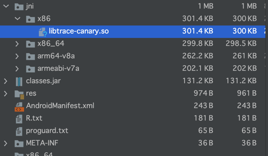

# matrix 编译打包部分学习总结

对模块进行单独clean和build的命令：

```
./graldew :apm: clean ---错误，因为clean前面有空格

./graldew :apm:clean

./graldew :apm:asDebug
```

经过单独对模块打包后会生成aar或者so。 包含cpp源码的module打出的aar会自动包含so库，如matrix-trace-canary：


## 一 从matrix-trace-canary 库入手，先易后难原则。

### 1.1 android 闭包

编译sdk版本和编译工具版本都是通过根目录的build.gradle文件中的ext扩展闭包来定义，方便管理。

- ndk的打包配置

在defualtConfig闭包下配置：

```
defaultConfig {
        minSdkVersion rootProject.ext.minSdkVersion
        targetSdkVersion rootProject.ext.targetSdkVersion
        versionCode 1
        versionName rootProject.ext.VERSION_NAME

        // native打包配置
        externalNativeBuild {
            cmake {
            // 给编译器配置 编译参数
                cppFlags "-std=gnu++11 -frtti -fexceptions"
            }
            ndk {
            // 配置产物支持的平台
                abiFilters "armeabi-v7a", "arm64-v8a", "x86", "x86_64"
            }
        }

    }
```

在Android闭包下：

```
 externalNativeBuild {
        cmake {
        // 指定构建脚本 
            path "CMakeLists.txt"
        }
    }
```

# Q&A

##   

1 当一个项目依赖本地有依赖远程的时候，可以考虑通过一个标志来分别引入两个gradle文件来管理 2 不同项目之间需要打包测试的时候，可以上传到本地仓库mavenLocal。 3
当需要对项目的tasks进行管理的时候，可以通过task生命周期监听来做：

```
project.tasks.whenTaskAdded {
    if (it.name?.equals("assembleDebug") || it.name?.equals("assembleRelease")) {
        //确保assemble命令在clean命令之后
        it.dependsOn "cleanBuildDirTask".with { taskName ->
            if (tasks.findByName(taskName)) {
                return tasks.findByName(taskName)
            }
            return task(taskName) {
                doFirst {
                    logger.lifecycle "Clean app bulid dir before assemble"
                    project.file(project.buildDir).deleteDir()
                }
            }
        }
    }
}
```


